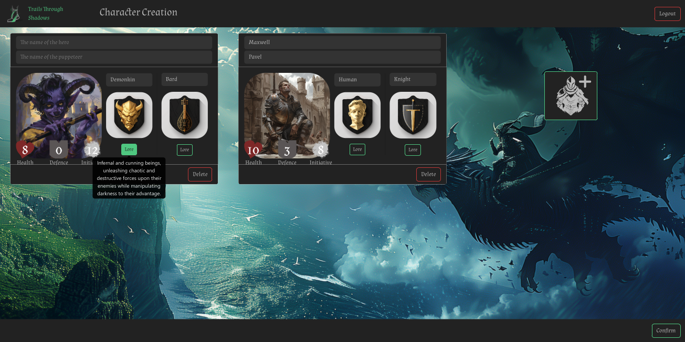
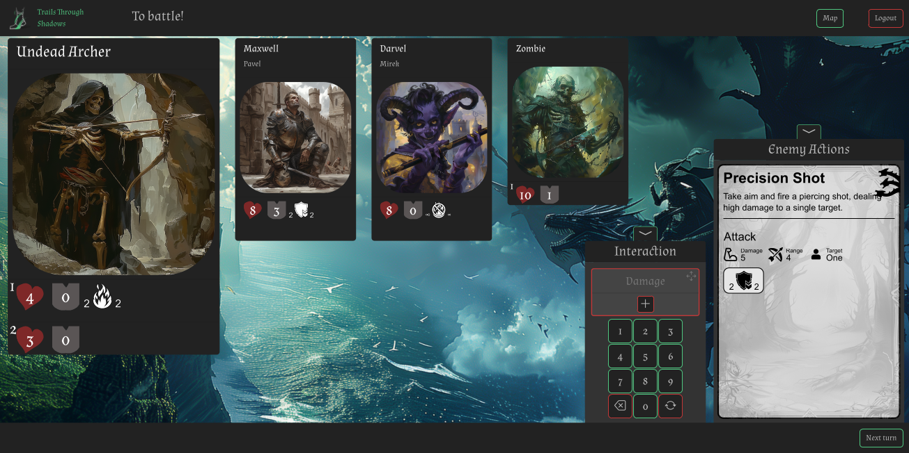
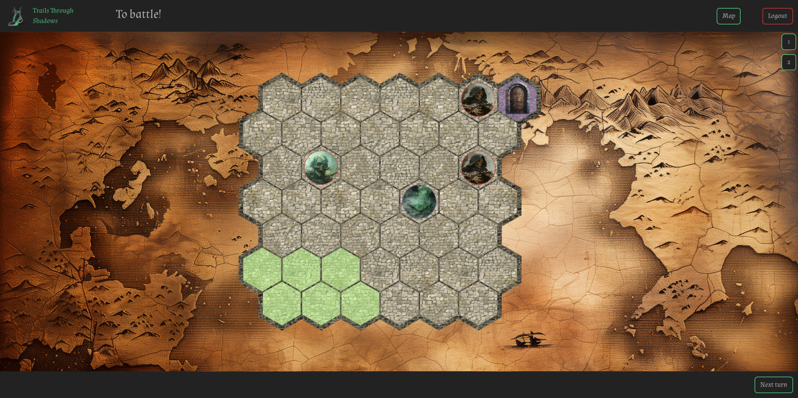

# TTS-Frontend

This repository contains the code for the TTS Frontend. It allows players to interact with the game world, create characters, adventures and actually play the game.

## Setup
- Clone the repository
  - `git clone https://github.com/Trails-Through-Shadows/TTS-Frontend.git`
- Install the required packages
  - `npm install`
- Build all necessary files
  - `npm run build`
- Create .env file
  - `cp .env.example .env`
  - Update .env file with database credentials and other necessary information

## Running the server
- Run the server *locally*
  - `npm run dev`
- Run the server *publicly*
  - `npm run dev -- --host`

## Accessing the app
- Open a web browser and go to `http://localhost:5173/` to access the frontend website
- Use the superuser credentials to login and access the site

## Documentation
- [Frontend Documentation](https://docs.tts-game.fun/frontend)

## Showcase

Here are some images of the frontend in action:

